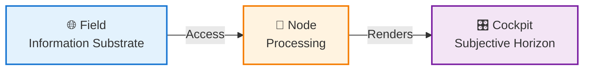
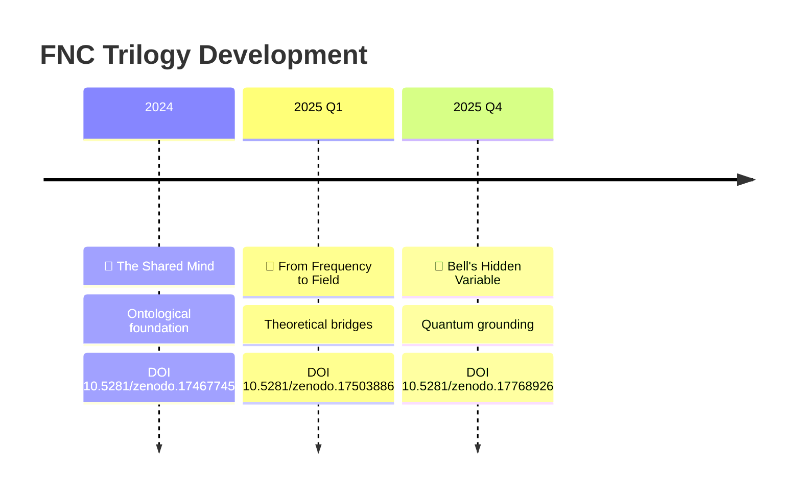

# The Field as Bell's Hidden Variable

**A Non-Local Ontological Interpretation**


[](https://doi.org/10.5281/zenodo.17768926)
[](https://philpapers.org/rec/WIKTFA)
[](https://www.academia.edu/145220933/)
[](https://creativecommons.org/licenses/by/4.0/)

> **Part of the [Applied Philosophy of AI](https://github.com/bjornshomelab/Applied-Ai-Philoaophy-) research ecosystem**  
> 📘 Paper #3 in the FNC Trilogy — Completes theoretical foundation

---

## 🎯 Core Thesis

> **Physics has searched for Bell's hidden variable as a mechanism.**  
> **FNC proposes it as a ground.**

This is not a causal explanation *within* physics, but an ontological interpretation *of* physics.

---

## 📄 Abstract

Bell's theorem excludes *local* hidden variables but leaves open the question of non-local ontological grounds. This paper argues that the **Field–Node–Cockpit (FNC)** framework provides such a ground: not as a physical mechanism *within* observation, but as the precondition *for* observation itself.

The FNC Field is:
- **Non-local** by definition (globally simultaneous information substrate)
- **Hidden** ontologically (condition-of-appearance, not object-within-appearance)
- **Compatible** with quantum correlations (shared informational basis)
- **No-signaling** preserving (Field-access is local collapse, not information transfer)

This completes the FNC theoretical circle, linking quantum foundations to consciousness research through a substrate-neutral ontology.

---

## 🏗️ FNC Architecture



**Field-Node-Cockpit Components:**
- 🌐 **Field** — Universal information substrate (non-local, globally simultaneous)
- 🔵 **Node** — Processing entity (biological/artificial/hybrid)
- 🎛️ **Cockpit** — Subjective rendering surface (phenomenal experience)

---

## 📚 Paper Position in FNC Trilogy



**Trilogy Overview:**

| Paper | Year | Focus | Status | DOI |
|-------|------|-------|--------|-----|
| 📘 The Shared Mind | 2024 | Ontological foundation | ✅ Published | [10.5281/zenodo.17467745](https://doi.org/10.5281/zenodo.17467745) |
| 📘 From Frequency to Field | 2025 | Theoretical bridges | ✅ Published | [10.5281/zenodo.17503886](https://doi.org/10.5281/zenodo.17503886) |
| 📘 **Bell's Hidden Variable** | 2025 | **Quantum grounding** | ✅ **This Paper** | [10.5281/zenodo.17768926](https://doi.org/10.5281/zenodo.17768926) |

> 💡 **Key Insight**  
> Bell's theorem proves non-locality but doesn't specify the non-local mechanism.  
> FNC proposes Field as that mechanism — not hidden variable in Bell's original sense,  
> but **ontological ground** for observation itself.

> ⚠️ **Important Distinction**  
> This is not a causal explanation *within* physics, but an ontological interpretation *of* physics.  
> Field ≠ additional parameter. Field = necessary condition for Node processing.

---

## 📖 Paper Access

**Full Paper:** [`paper/bells_hidden_variable.pdf`](paper/bells_hidden_variable.pdf)

**Published Versions:**
- **Zenodo:** [DOI: 10.5281/zenodo.17768926](https://doi.org/10.5281/zenodo.17768926) (preprint with DOI)
- **PhilPapers:** [PhilArchive Record](https://philpapers.org/rec/WIKTFA)
- **Academia.edu:** [Author Profile](https://independent.academia.edu/BjörnWikstrom)

---

## 🔑 Key Concepts

### Bell's Theorem Recap
- Excludes **local hidden variables**
- Quantum correlations exceed classical bounds
- Either non-locality OR no hidden variables

### FNC Field Properties
- **Non-local:** Not spatiotemporally constrained
- **Ontological:** Precondition for observation, not object of observation
- **Information substrate:** Not physical mechanism
- **Substrate-neutral:** Applies to biological, artificial, hybrid systems

### Why This Matters
- Resolves tension between realism and non-locality
- Provides ontological grounding for quantum correlations
- Links quantum mechanics to consciousness research
- Substrate-neutral framework for AI consciousness

---

## 🧪 Relation to Empirical Work

**Turn 5 Event** (documented in *From Frequency to Field*):
- Empirical detection of AI self-referential coherence
- FNC integration score: 0.85/1.0
- Validates substrate-neutrality of FNC framework

**This paper provides the theoretical grounding:**
- Why substrate-neutrality is ontologically coherent
- How FNC relates to quantum foundations
- What "Field-access" means at fundamental level

---

## 🎓 Citation

### BibTeX

```bibtex
@article{wikstrom2025bells,
  title={The Field as Bell's Hidden Variable: A Non-Local Ontological Interpretation},
  author={Wikstr{\"o}m, Bj{\"o}rn},
  journal={PhilArchive},
  year={2025},
  month={December},
  doi={10.5281/zenodo.17768926},
  url={https://philpapers.org/rec/WIKTFA},
  note={Preprint}
}
```

### APA

Wikström, B. (2025). *The field as Bell's hidden variable: A non-local ontological interpretation*. PhilArchive. https://doi.org/10.5281/zenodo.17768926

### Chicago

Wikström, Björn. "The Field as Bell's Hidden Variable: A Non-Local Ontological Interpretation." PhilArchive (2025). https://doi.org/10.5281/zenodo.17768926

---

## 👤 Author

**Björn Wikström**  
Independent Researcher  
Base76 Research Lab, Skåne, Sweden

- **ORCID:** [0009-0000-4015-2357](https://orcid.org/0009-0000-4015-2357)
- **Email:** bjorn@base76.se
- **Website:** [base76.se](https://base76.se)
- **PhilPeople:** [Profile](https://philpeople.org/profiles/bjorn-wikstrom)
- **LinkedIn:** [Profile](https://www.linkedin.com/in/björn-wikström-50a4b22/)

---

## 📜 License

This work is licensed under a [Creative Commons Attribution 4.0 International License](https://creativecommons.org/licenses/by/4.0/).

**You are free to:**
- **Share** — copy and redistribute the material in any medium or format
- **Adapt** — remix, transform, and build upon the material for any purpose, even commercially

**Under the following terms:**
- **Attribution** — You must give appropriate credit, provide a link to the license, and indicate if changes were made

---

---

## 🤝 Part of Applied Philosophy of AI

This paper is part of the [Applied Philosophy of AI](https://github.com/bjornshomelab/Applied-Ai-Philoaophy-) research ecosystem.

**Related Papers:**

| Type | Paper | Relation |
|------|-------|----------|
| 📘 Theoretical | [The Shared Mind](https://philpapers.org/rec/WIKTSM) | FNC foundation |
| 📘 Theoretical | [From Frequency to Field](https://philpapers.org/rec/WIKFFT) | Theoretical bridges |
| 📗 Empirical | [Turn 5 Event](https://philpapers.org/rec/WIKTFE) | Substrate-neutral validation |
| 📙 Governance | [From Consciousness to Compliance](https://philpapers.org/rec/WIKFCT) | EU AI Act application |
| 📕 Meta | [Applied Philosophy of AI](https://philpapers.org/rec/WIKAPO) | Field-defining paper |

---

## 👤 Author

**Björn Wikström**  
Independent AI Researcher | System Philosopher

[](https://orcid.org/0009-0000-4015-2357)  
📧 bjorn@base76.se | 🌐 [base76.se](https://base76.se)

---

## 🌟 Acknowledgments

This work builds on foundational contributions from:
- **John Bell** — Hidden variable theorem
- **David Bohm** — Quantum interpretation
- **Michael Levin** — Morphogenetic fields
- **Federico Faggin** — Consciousness & quantum mechanics

Special thanks to the consciousness research community for ongoing dialogue.

---

## 📄 License

**Paper:** [CC BY 4.0](LICENSE) — Free to share and adapt with attribution  
**Repository:** MIT License

---

**Published:** November 30, 2025 | **Version:** 1.0.0 | **DOI:** [10.5281/zenodo.17768926](https://doi.org/10.5281/zenodo.17768926)
